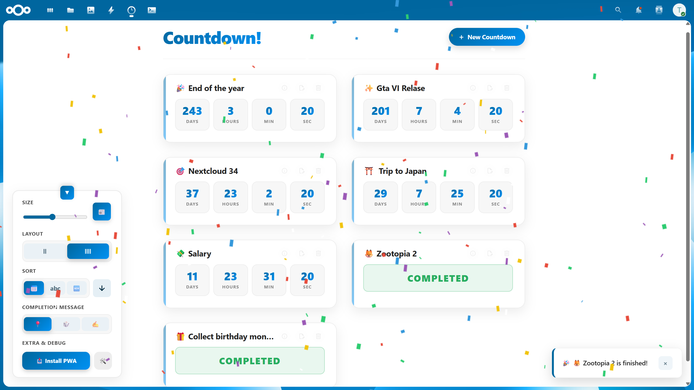
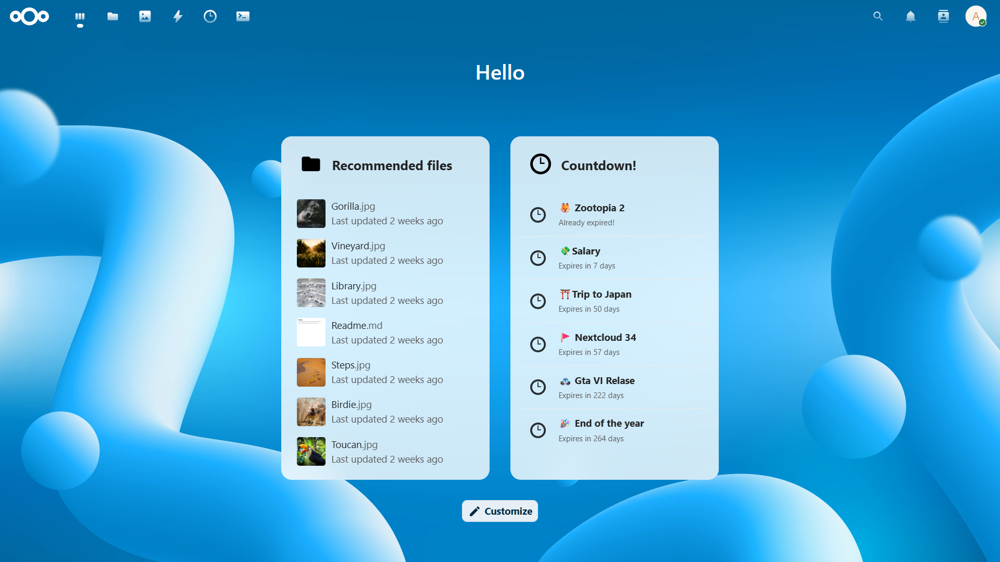
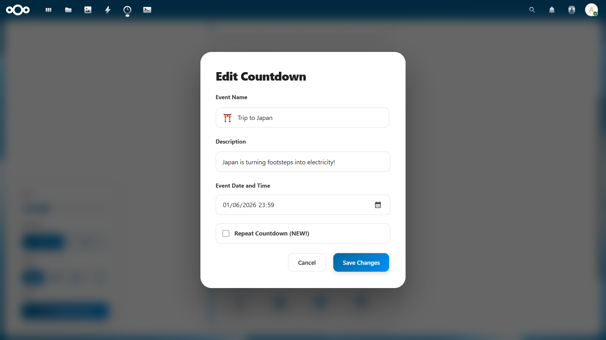
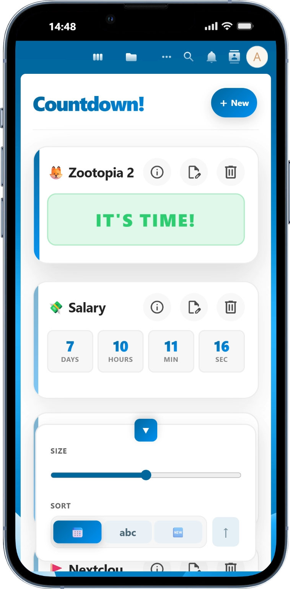
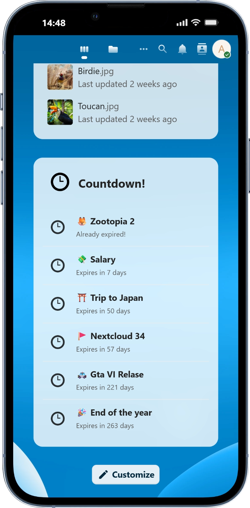
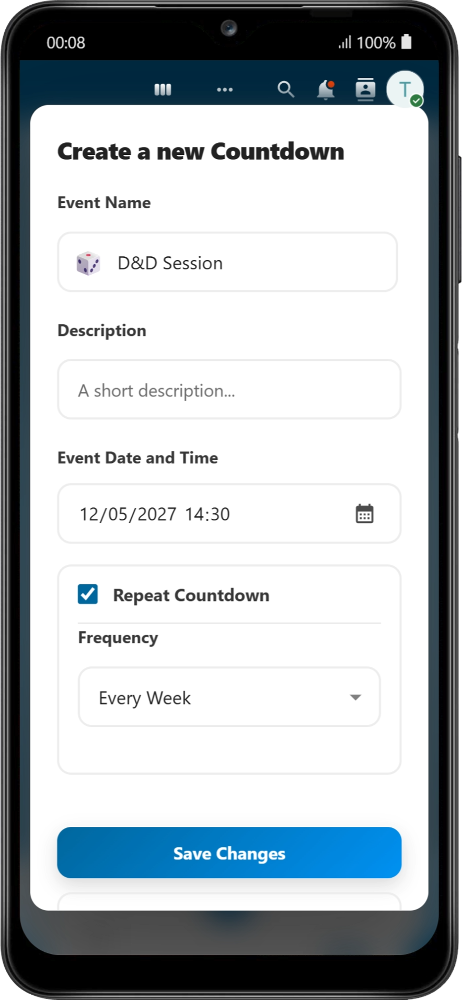

# 🕒 Countdown for Nextcloud

**Your most anticipated releases, in one place.**

**Built for Nextcloud**, this app keeps all your data fully private. Your events and most anticipated releases stay exclusively on your instance — no tracking, no profiling, no third-party access.

## ✨ Features

* 🕒 **Hyped Tracking**: Manage countdowns for games, movies, series, and personal events.
* 📊 **Dashboard Widget**: View all your upcoming releases directly on your Nextcloud Dashboard.
* 🔄 **Smart Recurrence**: Repeat events daily, weekly, monthly, or yearly (perfect for weekly show releases!).
* 🔔 **Stay Notified**: Receive automatic alerts via Nextcloud Activity and System Notifications when a timer expires.
* 🖼️ **Dual Layout**: Switch between **Stacked** (compact) and **Grid** (side-by-side) views to fit your style.
* 📱 **PWA Ready**: Install the app on your phone or desktop for a native-like, full-screen experience.
* 💻 **OCC Integration**: Administrators can manage countdowns using the OCC command line interface.
* ✏️ **Custom Completion**: Choose between default, random, or custom messages when a countdown finishes.
* 🗞️ **News Center**: Stay updated with the latest features and changes directly inside the app.
* 🎮 **Easter Eggs**: Discover secrets hidden inside the app inspired by pop culture!

## 📸 Screenshots

### Main Dashboard
<p align="center">
  <a href="https://apps.nextcloud.com/apps/countdown">
    
  </a>
</p>

### Dashboard Widget
<p align="center">
  <a href="https://apps.nextcloud.com/apps/countdown">
    
  </a>
</p>  

### Edit Panel
<p align="center">
  <a href="https://apps.nextcloud.com/apps/countdown">
    
  </a>
</p>

### Mobile PWA View
<p align="center">
  <a href="https://apps.nextcloud.com/apps/countdown">
    
  </a>
  &nbsp;&nbsp;&nbsp;&nbsp;
  <a href="https://apps.nextcloud.com/apps/countdown">
    
  </a>
  &nbsp;&nbsp;&nbsp;&nbsp;
  <a href="https://apps.nextcloud.com/apps/countdown">
    
  </a>
</p>

## 🚀 Installation

### Option 1: Nextcloud App Store (Recommended)
You can find **Countdown** directly in your Nextcloud instance:
1. Log in to your Nextcloud as an **Administrator**.
2. Click on your profile icon (top right) and select **Apps**.
3. Use the search bar to look for **"Countdown"**.
4. Click **Download and enable**.

### Option 2: Manual Installation
If you prefer to install it manually or want to use a specific version:
1. **Download**: Get the latest release from the [GitHub Releases](https://github.com/infinit7even/countdown/releases) page or the [Nextcloud App Store](https://apps.nextcloud.com/apps/countdown).
2. **Extract**: Unpack the `countdown.tar.gz` (or clone the repo) into your Nextcloud's `apps/` directory.
3. **Permissions**: Ensure the folder permissions are correct (usually `www-data` for Linux servers).
   ```bash
   chown -R www-data:www-data /path/to/nextcloud/apps/countdown
   ```
4. **Enable**: Go to the **Apps** section in your Nextcloud and click **Enable** on the Countdown app, or use the command line:
   ```bash
   sudo -u www-data php /path/to/nextcloud/occ app:enable countdown
   ```

## 🛠️ Creating your first Countdown
1. **Name & Date**: Simply click the "+" button, enter a title (e.g., "GTA VI Release"), and pick the target date and time.
2. **Add some Magic**: You can choose a custom **emoji** to represent your event and add a **description** for more details.
3. **Go Recurrent**: Enable the **Repeat** toggle if you want the countdown to restart automatically (Daily, Weekly, Monthly, or Yearly).
4. **The Celebration**: When the timer reaches zero, you'll receive a **Nextcloud Notification** and be greeted by a **burst of confetti**! 🎉

## 🔔 How Notifications Work

The app ensures you never miss an event using two methods:

*   **Instant Notifications**: If the app or dashboard widget is actively open in a browser tab or installed PWA, you get alerted the exact second the countdown ends (with confetti! 🎉).
*   **Background Notifications**: If the app is closed, Nextcloud's Background Jobs (`Cron`) will notify you based on your server's schedule (usually every 5-15 minutes). 

> [!NOTE]
> All notifications are pushed globally across your devices! You will receive them not only in the web interface, but also via the **Nextcloud Official Desktop Sync Client** and the **Nextcloud Mobile App**.

#### 1. Nextcloud Background Jobs
First, ensure your Nextcloud instance is set to **Cron** mode (Recommended) rather than AJAX:
1. Go to **Settings** > **Basic settings**.
2. Under **Background jobs**, select **Cron**.

#### 2. System Crontab
The app includes a background job that runs every 5 minutes, but you can achieve **per-minute precision** by adding a manual entry to your system's crontab. This ensures notifications arrive the exact second a timer expires.

**To edit your crontab:**
```bash
# For standard installations (e.g., Ubuntu/Debian)
sudo crontab -u www-data -e
```

**Add the appropriate line for your setup:**

| Environment | Frequency | Command |
| :--- | :--- | :--- |
| **Standard / Bare Metal** | Every minute | `* * * * * php /path/to/nextcloud/occ countdown:check-timers` |
| **Docker Container** | Every minute | `* * * * * docker exec --user www-data nextcloud php occ countdown:check-timers` |
| **Nextcloud All-in-One** | Every minute | `* * * * * docker exec --user www-data nextcloud-aio-nextcloud php occ countdown:check-timers` |
| **Snap** | Every minute | `* * * * * nextcloud.occ countdown:check-timers` |

> [!TIP]
> Use [crontab.guru](https://crontab.guru/) to experiment with different schedules or to understand the cron syntax better.

## 💻  Administrative Commands (OCC)

Administrators can use the `occ` command line tool to manage countdowns and trigger notification checks manually from the terminal.

| Command | Purpose |
| :--- | :--- |
| `countdown:check-timers` | Manually trigger an immediate notification check for all users. |
| `countdown:list <user_id>` | List all active countdowns for a specific user (including IDs). |
| `countdown:add <user_id> <name> <target_date>` | Add a new countdown programmatically. |
| `countdown:delete <user_id> <id>` | Delete a specific countdown using its numeric ID. |

**Example: Adding a countdown via Docker**
```bash
docker exec --user www-data nextcloud php occ countdown:add "user_id" "Event Name" "2026-12-25 00:00:00"
```

> [!NOTE]
> Use the `--help` flag with any command (e.g., `php occ countdown:add --help`) to see all available options, such as setting emojis or descriptions via CLI.

## 🪀Dashboard Widget
To see your countdowns at a glance:
1. Go to your **Nextcloud Dashboard**.
2. Scroll to the bottom and click **Edit widgets**.
3. Enable the **Countdown** widget.

## ❤️ Support the Project

If you find **Countdown** useful and want to support its development:
*   **Star the Project**: Give us a star on [GitHub](https://github.com/infinit7even/countdown) to help others discover it.
*   **Leave a Review**: Share your experience and feedback on the [Nextcloud App Store](https://apps.nextcloud.com/apps/countdown).
*   **Support on Ko-fi**: Help me keep the project active and always updated to the latest Nextcloud versions by [buying me a coffee](https://ko-fi.com/infinit7even). ☕

Your support helps me keep improving the app and adding new "magic" features! 🦊✨

## 😊 Contributing & Feedback

* **Bugs & Features**: Found a bug or have a great idea? Open an issue on [GitHub Issues](https://github.com/infinit7even/countdown/issues).
* **Discussions**: Join the community for questions and tips on [GitHub Discussions](https://github.com/infinit7even/countdown/discussions).
* **Source Code**: Explore the code or fork the project at [GitHub Repository](https://github.com/infinit7even/countdown).

## ⚖️ License
This project is licensed under the **AGPL-3.0-or-later** license. See the [LICENSE](LICENSE) file for details.
